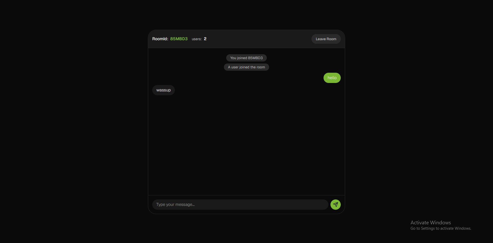
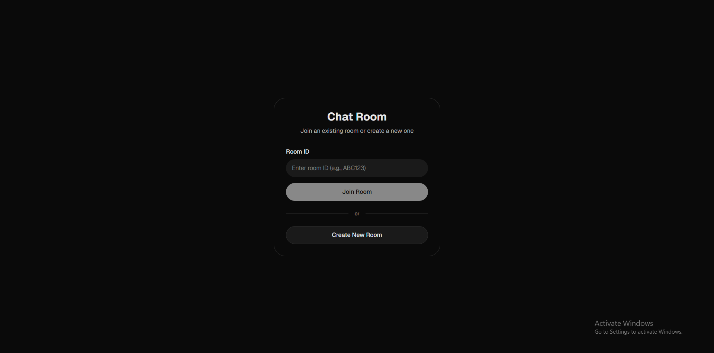

# Real-Time Chat Application

A modern, real-time chat application built with Node.js, WebSockets, React, and TypeScript. Create rooms, join conversations, and chat with users in real-time with a beautiful interface.

## ✨ Features

- **Real-time messaging** - Instant message delivery using WebSockets
- **Room management** - Create, join, and leave chat rooms
- **Modern UI** - Beautiful design built with Tailwind CSS
- **Type-safe** - Built with TypeScript for better development experience
- **User-friendly** - Intuitive interface for seamless communication

## 🛠️ Tech Stack

- **Frontend**: React, TypeScript, Tailwind CSS
- **Backend**: Node.js
- **Real-time Communication**: WebSockets (ws)
- **Package Manager**: npm

## 📸 Screenshots

### Main Chat Interface



### Room Creation



## 🚀 Getting Started

### Prerequisites

- Node.js
- npm
- Git

### Installation

1. **Clone the repository**

   ```bash
   git clone https://github.com/null-kaustubh/ws-chat-app.git
   cd ws-chat-app
   ```

2. **Install backend dependencies**

   ```bash
   cd ws
   npm install
   ```

3. **Install frontend dependencies**

   ```bash
   cd frontend
   npm install
   ```

### Running the Application

1. **Start the backend server**

   ```bash
   cd ws
   npm run dev
   ```

2. **Start the frontend application**

   ```bash
   cd frontend
   npm run dev
   ```

3. **Open your browser**
   Navigate to `http://localhost:5173`

## 🎯 Usage

### Creating a Room

1. Click on "Create Room" button
2. You'll be redirected to the room with ID on the top
3. Share the room ID with others
4. Chat with your friends

### Joining a Room

1. Enter the room ID
2. Click on "Join Room" button
3. Start chatting!

### Leaving a Room

1. Click the "Leave Room" button to exit the current room
2. You'll be redirected to the main lobby

## 📝 License

This project is licensed under the MIT License - see the [LICENSE](LICENSE) file for details.

---

⭐ **Star this repository if you found it helpful!**
